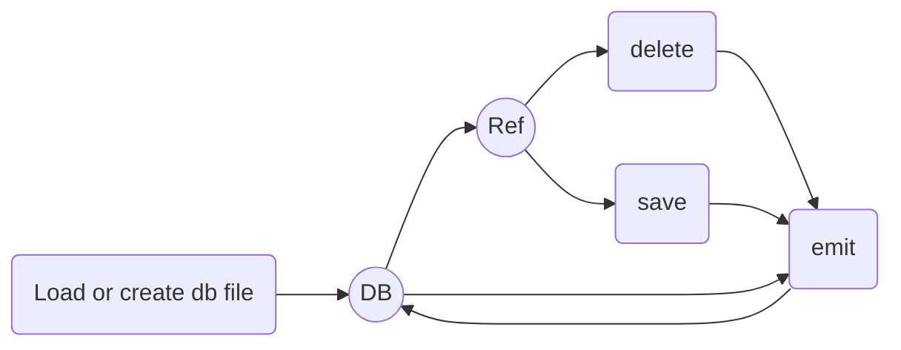

# Welcome to FireLight !

FireLight is a very simple and light database that allows you to share an object with several processes.

## Get Started

### Install

`yarn add @dev-your-ops/firelight`

or

`npm i @dev-your-ops/firelight`

### Usage

By default, the database file is created at the root of the project with the name "db.json".

    const db = require('@dev-your-ops/firelight')
    db.load()

> you can give a path as an option to store the db wherever you want :
>
> `db.load('/tmp/db.json')`

#### _get a ref_

`const user = db.ref('/user/1')`

> it will take the user if it exists or will create the space for it

#### _get ref data_

You can access the data by using the association function.

`const data = user.data()`

#### _set data_

`user.set({firstname: 'john'});`

> if you pass true as the second argument, the new data and the old data will be merged together:
>
> `user.set({lastname: 'doe'}, true); // user.data() = {firstname: 'john', lastname: 'doe'}`

#### _Example_

    const db = require('@dev-your-ops/firelight')
    db.load()

    // subsribe to change
    db.on('onload', (e) => console.log('onload:', e));
    db.on('set', (e) => console.log('set:', e));
    db.on('delete', (e) => console.log('delete:', e));

    // create a user
    const user = db.ref('/user/1')

    // set user data
    user.set({ name: 'test' })

    // update user data
    user.set({ tab: [1, 2, 3] }, true)

    console.log(user.data())
    // => { name: 'test', tab: [1, 2, 3] }

    // delete the user
    db.deleteRef(user.path)

# ! important

if you are using nodemon or any other hot reload method, then you will need to ignore the db.json file.
for example, for nodemon, add a file named "nodemon.json" with:

    // nodemon.json
    {
    	"ignore": ["db.json"]
    }

## api

the **db** object:

| Property              | type       | what is it ?                                                             |
| --------------------- | ---------- | ------------------------------------------------------------------------ |
| data                  | `Object`   | is an object with containe the bd json file parsed                       |
| save()                | `Function` | write the stringified data in the json db file                           |
| ref(**_path_**)       | `Function` | get or create a new space to the db associeted with the gived **_path_** |
| deleteRef(**_path_**) | `Function` | delete the space on the db at the gived **_path_**                       |

the **ref** object:

| Property                     | type       | what is it ?                                                                             |
| ---------------------------- | ---------- | ---------------------------------------------------------------------------------------- |
| context                      | `Object`   | the parent db object                                                                     |
| path                         | `Object`   | the current db path                                                                      |
| set(**_data_**, **_merge_**) | `Function` | set **_data_** of ref space (if **_merge_** is true the new and old data will be merged) |
| data()                       | `Function` | get the ref data                                                                         |

## Events

you can subsribe to db event to know whats happened with the data and share it between other process

    // fire only at first instansiation
    db.on('onload', (data) => console.log('data:', data));

    db.on('set', (e) => console.log('set:', e));
    db.on('delete', (e) => console.log('delete:', e));

## live cycle (I guess :$)

